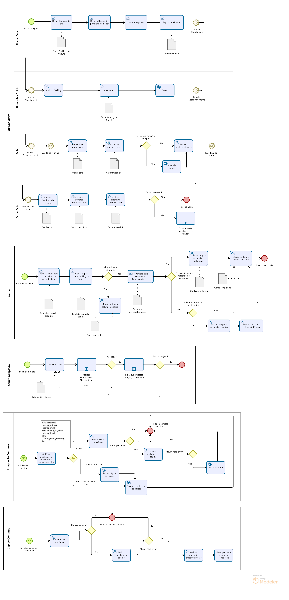
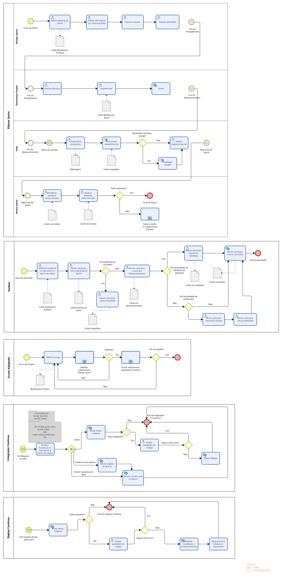
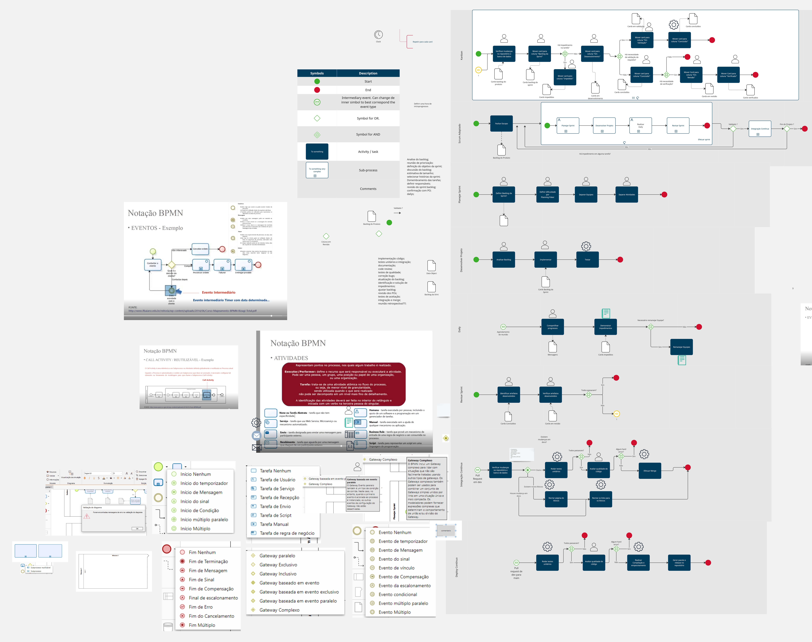
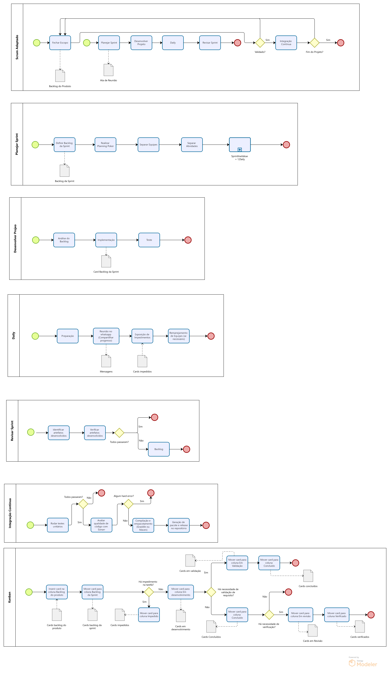

# 1.3. Módulo Modelagem BPMN

<!--
Foco_3: Modelagem na Notação BPMN.

Entrega Mínima: Modelagem BPMN, orientando-se por uma abordagem metodológica à escolha da equipe (por exemplo, combinação de práticas do Scrum & XP).

Apresentação (em sala) explicando o detalhamento metodológico desenhado como um modelo em BPMN, com: (i) rastro claro aos membros participantes (MOSTRAR QUADRO DE PARTICIPAÇÕES & COMMITS); (ii) justificativas & senso crítico sobre as escolhas metodológicas adotadas para o projeto; e (iii) comentários gerais sobre o trabalho em equipe. Tempo da Apresentação: +/- 5min. Recomendação: Apresentar diretamente via Wiki ou GitPages do Projeto. Baixar os conteúdos com antecedência, evitando problemas de internet no momento de exposição nas Dinâmicas de Avaliação.

A Wiki ou GitPages do Projeto deve conter um tópico dedicado ao Módulo Modelagem BPMN, com modelagem BPMN (viés metodológico), histórico de versões, referências, e demais detalhamentos gerados pela equipe nesse escopo.

Demais orientações disponíveis nas Diretrizes (vide Moodle). -->

## Introdução

&emsp;&emsp;
O BPMN (Business Process Model and Notation) oferece modelos e notações gráficas para representar de maneira visual os fluxos de atividades e as etapas dos processos existentes ambientes de empresa e projeto, desde o seu início até sua conclusão.

&emsp;&emsp;
O principal foco do BPMN é fornecer modelos ou notações de fácil entendimento para todas as pessoas envolvidas na empresa ou projeto. Permitindo assim que os processos, fluxos de trabalho, funcionalidades, organização e recursos, seja ministrados da maneira clara e mais eficiente possível com os membros do grupo alinhados aos objetivos principais.

## Objetivo

&emsp;&emsp;
O objetivo da realização deste BPMN (Business Process Model and Notation) é oferecer uma visão clara e estruturada dos processos adotados pela equipe, facilitando a comunicação, a organização e a coordenação entre os membros. Buscamos representar visualmente o fluxo de trabalho e as etapas de execução, destacando os pontos críticos para otimizar a eficiência e a adaptabilidade dos métodos de trabalho. Essa abordagem permite que todos os envolvidos compreendam facilmente as práticas da equipe, promovendo alinhamento e melhoria contínua.

## Metodologia

&emsp;&emsp;
Para a realização do BPMN, inicialmente utilizamos a ferramenta Miro, com a participação direta de grande parte da equipe. Optamos pelo Miro devido à familiaridade que a equipe tem com a plataforma, o que permitiu uma colaboração mais ágil e interativa, facilitando o mapeamento inicial dos processos em um ambiente visualmente acessível e intuitivo. Após essa construção colaborativa, o modelo foi adaptado para o Bizagi, onde refinamos os detalhes de notação e alinhamos os elementos do BPMN com maior precisão técnica. Essa abordagem híbrida nos permitiu aproveitar o melhor de ambas as ferramentas, garantindo clareza e exatidão no modelo final.

&emsp;&emsp;
Na primeira adaptação do artefato para o software Bizagi, o conhecimento do software era mínimo, o que resultou em um modelo com falhas de notação. Além disso, o BPMN criado anteriormente carecia de revisões. Portanto, foi realizada uma segunda reunião para reavaliar o projeto.

&emsp;&emsp;
Como foi uma evolução no documento que possuíamos no Miro, não coletamos a primeira real versão realizada. Contudo, a primeira adaptação ao Bizagi seguiu fielmente o que havia sido levantado nesta versão, tratando então ela como a primeira versão do artefato. As demais versões estão disponibilizadas no documento a fim de evidenciar a evolução do BPMN da equipe.

## Resultado

A versão final do BPMN da equipe pode ser vista na Figura 4.

<b>Figura 4 -</b> BPMN revisado versão 1.3

<b>Fonte:</b> Lemos, 2024.

O diagrama foi devidamente validado pela ferramenta Bizagi. Nenhum erro, advertência ou sugestão foi relatado pelo software.

### Versões Anteriores

Visualizar versão 1.2

### Versão 1.2

A Figura 1 apresenta não só o BPMN revisado como também alguns materiais utilizados durante sua confecção.

<b>Figura 1 -</b> BPMN revisado versão 1.2

<b>Fonte:</b> Lemos, 2024.

Visualizar versão 1.1

### Versão 1.1

A Figura 2 apresenta não só o BPMN revisado como também alguns materiais utilizados durante sua confecção.

<b>Figura 2 -</b> BPMN revisado versão 1.1

<b>Fonte:</b> Silva, Lemos, Sandes, Carvalho, 2024.

Visualizar versão 1.0

### Versão 1.0

Primeira adaptação ao Bizagi pode ser vista na Figura 3.

<b>Figura 3 -</b> BPMN adaptado ao Bizagi versão 1.0

<b>Fonte:</b> Bartz, Rodrigues, Reis, Sandes, Lemos,  Carvalho, Silva, Santos, Alves, Santos, 2024.

### Gravação do BPMN

> Como resultado da execução da técnica, obtivemos o artefato apresentado abaixo, que apresenta toda a gravação do BPMN na ferramenta <a href="https://teams.com">Teams</a>.

<iframe src="https://unbbr.sharepoint.com/sites/ArquitesoftwareTOTOLA/_layouts/15/embed.aspx?UniqueId=9b08de7f-65f3-45e4-ad0b-8daf859a157b&embed=%7B%22ust%22%3Atrue%2C%22hv%22%3A%22CopyEmbedCode%22%7D&referrer=StreamWebApp&referrerScenario=EmbedDialog.Create" width="640" height="360" frameborder="0" scrolling="no" allowfullscreen title="Meeting in _General_-20241101_201453-Gravação de Reunião.mp4"></iframe>

### Bibliografia

> [1] <b>Business Process Model & Notation™ (BPMN™)</b>. Disponível em: <https://www.omg.org/bpmn/>. Acesso em: 30 out. 2024.
> 
> [2] <b>SERRANO, Milene.</b> Videoaula: 04 - VideoAula - DSW-BPMN. [Online]. Disponível em: https://unbbr-my.sharepoint.com/:v:/g/personal/mileneserrano_unb_br/EU1pA17SX3VEttZ6KlARD_ABd-SNiJJ1AwODqrO9zEfQBw?e=vTxaUp. Acesso em: 02 nov. 2024.

## Participantes

| Matrícula | Aluno                                 | Git                                                           |
|-----------|---------------------------------------|---------------------------------------------------------------|
| 221007813 | André Emanuel Bispo da Silva          | [Hunter104](https://github.com/Hunter104)                     |
| 221007869 | Artur Henrique Holz Bartz             | [H0lzz](https://github.com/H0lzz)                             |
| 221931265 | Carlos Eduardo Rodrigues              | [carlos-kadu](https://github.com/carlos-kadu)                 |
| 221021886 | Cássio Sousa dos Reis                 | [csreis72](https://github.com/csreis72)                       |
| 221031149 | Danilo César Tertuliano Melo          | [DaniloCTM](https://github.com/DaniloCTM)                     |
| 221008024 | Eduardo Matheus dos Santos Sandes     | [DiceRunner714](https://github.com/DiceRunner714)             |
| 170010872 | Gabriela de Oliveira Lemos            | [heylisten64](https://github.com/heylisten64)                 |
| 221008150 | João Antonio Ginuino Carvalho         | [joaoseisei](https://github.com/joaoseisei)                   |
| 221037993 | Patrícia Helena Macedo da Silva       | [patyhelenaa](https://github.com/patyhelenaa)                 |
| 221008445 | Samara Letícia Alves dos Santos       | [samarawwleticia](https://github.com/samarawwleticia)         |
| 221008697 | Sunamita Vitória Rodrigues dos Santos | [sunamit](https://github.com/sunamit)                         |
| 211062526 | Thomas Queiroz Souza Alves            | [thmasq](https://github.com/thmasq)                           |
| 202017263 | Vinicius de Oliveira Santos           | [ViniciussdeOliveira](https://github.com/ViniciussdeOliveira) |

## Histórico de Versão

| Versão | Data  |                   Atividade                   |                           Autor(es)                            |                        Revisor(es)                        | Data de Revisão |
|:------:|:-----:|:---------------------------------------------:|:--------------------------------------------------------------:|:---------------------------------------------------------:|:---------------:|
|  1.0   | 30/10 |    Adição da introdução da modelagem BPMN     | [Vinícius de Oliveira](https://github.com/ViniciussdeOliveira) |    <!--[nome](https://github.com/Usuario do github)-->    | <!-- xx/xx -->  |
|  1.1   | 01/11 |        Adição do quadro visual do BPMN        | [Vinícius de Oliveira](https://github.com/ViniciussdeOliveira) |    <!--[nome](https://github.com/Usuario do github)-->    | <!-- xx/xx -->  |
|  1.2   | 02/11 |       Adição da tabela de participantes       |             [Thomas Q](https://github.com/thmasq)              |                                                           |                 |
|  1.3   | 03/11 |      Adição dos objetivos e metodologia       |        [Gabriela Lemos](https://github.com/heylisten64)        |                                                           |                 |
|  1.4   | 03/11 | Adição do BPMN revisado e controle de versões |        [Gabriela Lemos](https://github.com/heylisten64)        |                                                           |                 |
|  1.5   | 03/11 |  Adição do BPMN revisado adaptado ao Bizagi   |        [Gabriela Lemos](https://github.com/heylisten64)        | [João Antonio G. Carvalho](https://github.com/joaoseisei) |      03/11      |

## Controle de Revisão

|                        Revisor(es)                        |                                             O que foi realizado                                             |
|:---------------------------------------------------------:|:-----------------------------------------------------------------------------------------------------------:|
| [João Antonio G. Carvalho](https://github.com/joaoseisei) | Padronizei o documento e adicionei as reuniões para a confecção do mesmo, além de atualizar os integrantes. |