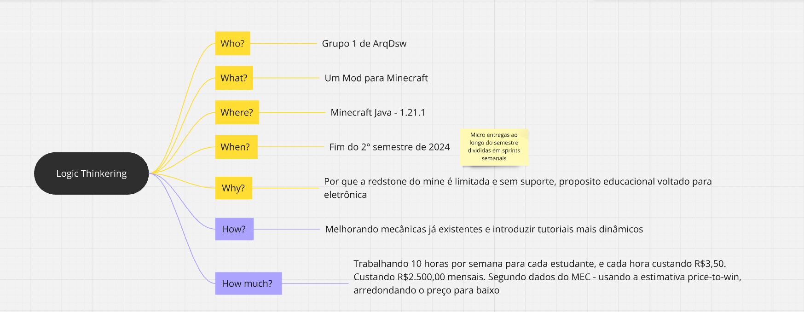
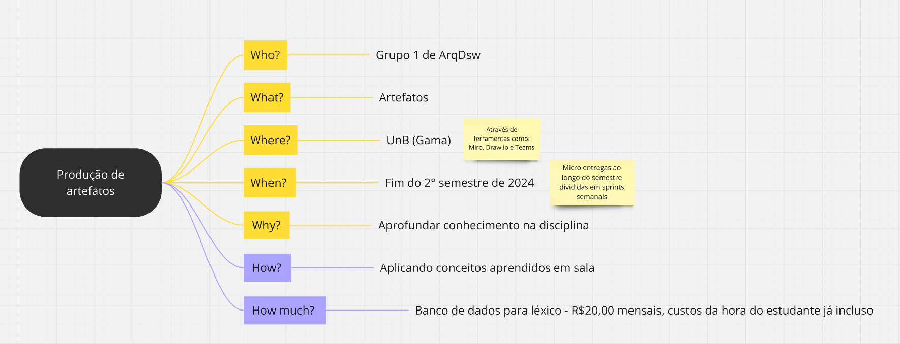

# 5W2H

## Introdução

O 5W2H é uma ferramenta de gestão e planejamento que ajuda a definir e estruturar ações ou projetos de forma clara e objetiva. Seu nome vem das perguntas essenciais que devem ser respondidas:
**What** (o que será feito?), **Why** (por que será feito?), **Who** (quem irá fazer?), **Where** (onde será feito?), **When** (quando será feito?), **How** (como será feito?) e **How much** (quanto vai custar?). Essa metodologia auxilia na organização, garantindo que todos os aspectos de uma tarefa estejam planejados e detalhados, facilitando a execução e a comunicação.

## Ferramentas Utilizadas

Para a elaboração do 5W2H, foi utilizada a ferramenta do [Teams](https://teams.microsoft.com/) para comunicação e o [miro](https://miro.com) para confecção. A Figura 1 representa o a versão final do 5W2H Logic Thinkering. A Figura 2 representa o a versão final do 5W2H Produção de artefatos.

## 5W2H Completo

Figura 1: 5W2H (Logic Thinkering)

Figura 2: 5W2H (Produção de artefatos)

### Quadro Visual do 5W2H

> Como resultado da execução da técnica, obtivemos o artefato apresentado abaixo, que apresenta todas as ideias coletadas e priorizadas durante a realização do 5W2H na ferramenta <a href="https://miro.com">Miro</a>.

<iframe width="768" height="432" src="https://miro.com/app/live-embed/uXjVLK97tCs=/?moveToViewport=1603,-572,2814,1389&embedId=626642198204" frameborder="0" scrolling="no" allow="fullscreen; clipboard-read; clipboard-write" allowfullscreen></iframe>
Figura 3: Quadro 5W2H miro

### Gravação do 5W2H

> Como resultado da execução da técnica, obtivemos o artefato apresentado abaixo, que apresenta toda a gravação e as ideias coletadas e priorizadas durante a realização do 5W2H na ferramenta <a href="https://teams.com">Teams</a>.

<iframe src="https://unbbr.sharepoint.com/sites/ArquitesoftwareTOTOLA/_layouts/15/embed.aspx?UniqueId=873ade7e-8a2c-4127-9d77-a38ff3af3b75&embed=%7B%22ust%22%3Atrue%2C%22hv%22%3A%22CopyEmbedCode%22%7D&referrer=StreamWebApp&referrerScenario=EmbedDialog.Create" width="640" height="360" frameborder="0" scrolling="no" allowfullscreen title="Meeting in _General_-20241102_135114-Gravação de Reunião.mp4"></iframe>
Vídeo 1 - Gravação do 5W2H

## Bibliografia

> [1] **SERRANO, Milene**. VideoAula: 02f - VideoAula - DSW-Base - Estimativas. Disponível em: https://unbbr-my.sharepoint.com/:v:/g/personal/mileneserrano_unb_br/EQvzWZwb9llHjmuA0XrEAJ4BPdH0irPT8XMP6ZFN1iFUXA?e=HUMr5L. Acesso em: 02 Nov. de 2024.
> [2] **SERRANO, Milene**. VideoAula: 02f - VideoAula - DSW-Base - Estimativas. Disponível em: https://unbbr-my.sharepoint.com/:v:/g/personal/mileneserrano_unb_br/EZdJoRqqwftEh3bbs6uRmJ4BSpJrfNUM9d4rUYHZNdC65Q?e=NexLQY. Acesso em: 02 Nov. de 2024.

## Participantes

| Matrícula | Aluno                             | Git                                               |
| --------- | --------------------------------- | ------------------------------------------------- |
| 221931265 | Carlos Eduardo Rodrigues          | [carlos-kadu](https://github.com/carlos-kadu)     |
| 221008024 | Eduardo Matheus dos Santos Sandes | [DiceRunner714](https://github.com/DiceRunner714) |
| 170010872 | Gabriela de Oliveira Lemos        | [heylisten64](https://github.com/heylisten64)     |
| 221008150 | João Antonio Ginuino Carvalho     | [joaoseisei](https://github.com/joaoseisei)       |
| 211062526 | Thomas Queiroz Souza Alves        | [thmasq](https://github.com/thmasq)               |
| 221037993 | Patrícia Helena Macedo da Silva   | [patyhelenaa](https://github.com/patyhelenaa)     |

# Histórico de versão

| Versão | Data da alteração |      Alteração       |                    Responsável                    | Revisor | Data de revisão |
| :----: | :---------------: | :------------------: | :-----------------------------------------------: | :-----: | :-------------: |
|  1.0   |       02/10       | Criação do documento | [Patricia Helena](https://github.com/patyhelenaa) |         |                 |
