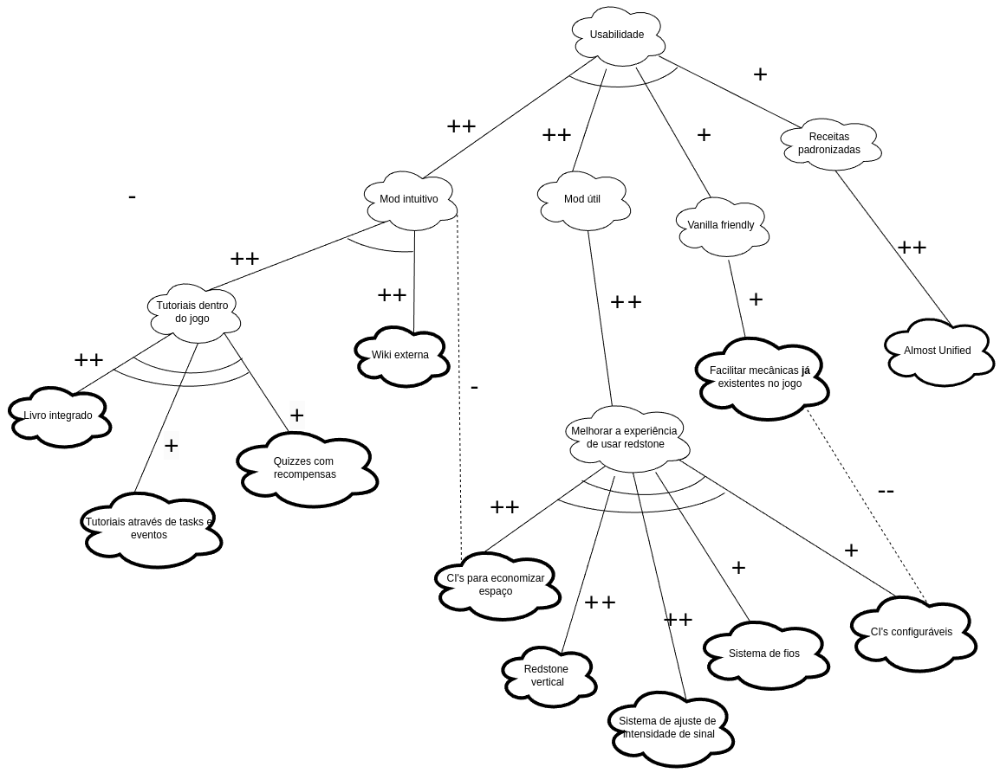
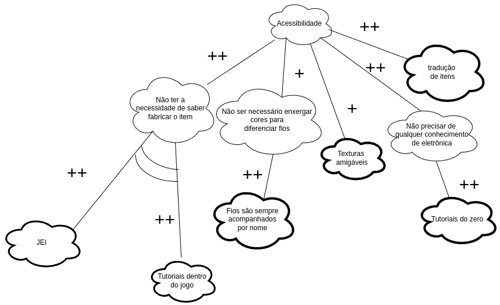
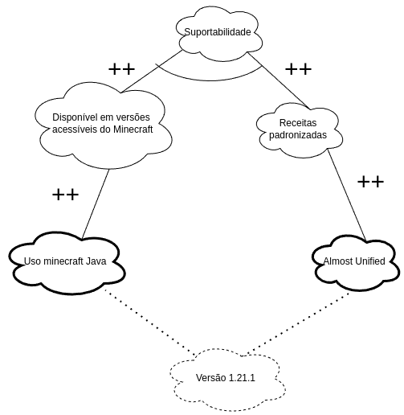

# NFR FRAMEWORK

## Introdução

&emsp;&emsp;
O NFR Framework é uma abordagem que visa capturar, representar e analisar requisitos não funcionais em projetos de desenvolvimento de software. Diferente dos requisitos funcionais, que especificam o que o sistema deve fazer, os requisitos não funcionais descrevem as restrições e as qualidades que o sistema deve atender, como desempenho, segurança e usabilidade. Este framework ajuda a gerenciar a complexidade de incorporar esses aspectos qualitativos, proporcionando uma visão estruturada para garantir que os objetivos de qualidade sejam atendidos durante todo o ciclo de vida do projeto.

## Objetivo

&emsp;&emsp;
O objetivo do grupo com o uso do NFR Framework é estabelecer uma abordagem que permita mapear e priorizar requisitos não funcionais, garantindo que eles sejam integrados desde o início do processo de desenvolvimento. Com a aplicação do NFR Framework, o grupo poderá identificar possíveis conflitos entre diferentes requisitos de qualidade, encontrar compromissos e traçar estratégias para sua implementação.

## Metodologia

&emsp;&emsp;
Para aplicar o NFR Framework, o grupo optou por realizar uma reunião no Teams e utilizar a plataforma draw.io para a construção dos diagramas. A familiaridade com essas ferramentas facilitou a modelagem e colaboração entre os membros do grupo. 
Para a construção do diagrama, foram definidas metas de qualidade que, posteriormente, foram decompostas em sub-metas. Em seguida, analisamos as interdependências entre essas metas, registrando as decisões e compromissos estabelecidos durante o processo.

# Resultados

## NFR001 - Usabilidade

## NFR002 - Acessibilidade

## NFR003 - Suportabilidade

## NFR004 - Performance

## NFR GERAL - Com propagação de Impactos

---

## Bibliografia

> [1] <b>SERRANO, Maurício & SERRANO, Milene.</b> Requisitos de Software - Aula 17: Modelagem de Requisitos NFR Framework. Disponível em: https://drive.google.com/file/d/1qDJKmgAd_r9zvAtdmtetMXqz6rBsqpZX/. Acesso em: 30 out. de 2024.

## Participantes

| Matrícula | Aluno                             | Git                                               |
| --------- | --------------------------------- | ------------------------------------------------- |
| 221008445 | Samara Letícia Alves dos Santos | [samarawwleticia](https://github.com/samarawwleticia) |
| 221037993 | Patrícia Helena Macedo da Silva        | [patyhelenaa](https://github.com/patyhelenaa)     |
| 221008024 | Eduardo Matheus dos Santos Sandes | [DiceRunner714](https://github.com/DiceRunner714) |
| 170010872 | Gabriela de Oliveira Lemos        | [heylisten64](https://github.com/heylisten64)     |
| 221008150 | João Antonio Ginuino Carvalho     | [joaoseisei](https://github.com/joaoseisei)       |
| 211062526 | Thomas Queiroz Souza Alves            | [thmasq](https://github.com/thmasq) |

## Histórico de versão

| Versão | Data da alteração | Alteração | Responsável | Revisor | Data de revisão |
| --- | ----- | ---------- | ------------ | ---------| -------- |
| 1.0 | 03/11 | Criação do documento | [Samara Letícia](https://github.com/samarawwleticia) | [Carlos Rodrigues](https://github.com/carlos-kadu) | 03/11 |
                                         

## Controle de Revisão

|                        Revisor(es)                        |                                  O que foi realizado                                   |
| :-------------------------------------------------------: | :------------------------------------------------------------------------------------: |
|    [Carlos Rodrigues](https://github.com/carlos-kadu)     |  Adição de bibliografia e tabulação, bem como reescrita de parte do objetivo e da metodologia.  |