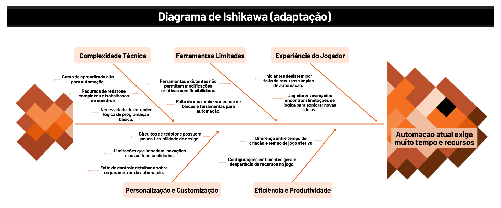

# Diagrama de Ishikawa (adaptação)

## Introdução

Também conhecido como diagrama de causa e efeito ou diagrama espinha de peixe, o diagrama Ishikawa é uma ferramenta visual usada para identificar, explorar e visualizar as possíveis causas de um problema específico. Esse diagrama é bastante utilizado para análise de qualidade e solução de problemas, auxiliando equipes a compreender as raízes dos problemas e a organizarem as informações de forma clara e objetiva.

## Objetivo

O objetivo da equipe com a realizacao do artefato foi criar um diagrama que permitisse uma análise detalhada das causas da problemática: "**Automação atual exige muito tempo e recursos**", promovendo uma visão organizada que facilite a tomada de decisões e a implementação de melhorias.

A estrutura do diagrama se assemelha a uma espinha de peixe, com a "cabeça" representando o problema central e as "espinhas" principais dividindo-se em categorias que englobam possíveis causas (como complexidade técnica, ferramentas limitadas, experiância do jogador e etc). Essa abordagem permite uma análise detalhada e sistemática que pode ajudar o grupo a identificar as causas raízes e, assim, propor soluções mais eficazes.

## Metodologia

A construção do diagrama de Ishikawa adaptado foi realizada na plataforma Canva, uma ferramenta online que oferece recursos visuais de fácil manuseio e diversas opções de design.

A primeira etapa consistiu em identificar e definir claramente o problema a ser analisado, posteriormente, com o problema definido, foram identificadas as "categorias" principais de possíveis causas. Essas "categorias" servem como "espinhas" principais do diagrama. Em cada "espinha" principal foram detalhadas as subcausas que contribuem para o problema.

## Resultado

Figura 1: Adaptação do Diagrama de Ishikawa. Autores: <a href="https://github.com/carlos-kadu" target="_blank">Carlos Rodrigues</a> e <a href="https://github.com/patyhelenaa" target="_blank">Patrícia Silva</a>.

## Participantes

| Matrícula | Aluno                           | Git                                           |
| --------- | ------------------------------- | --------------------------------------------- |
| 221031265 | Carlos Eduardo Rodrigues        | [carlos-kadu](https://github.com/carlos-kadu) |
| 221037993 | Patrícia Helena Macedo da Silva | [patyhelenaa](https://github.com/patyhelenaa) |

---

## Histórico de Versão

| Versão | Data da alteração |      Alteração       |                  Responsável                  | Revisor | Data de revisão |
| :----: | :---------------: | :------------------: | :-------------------------------------------: | :-----: | :-------------: |
|  1.0   |       02/11       | Criação do documento | [carlos-kadu](https://github.com/carlos-kadu) |  [Eduardo Sandes](https://github.com/DiceRunner714)       | 03/11                |

## Controle de Revisão

|                        Revisor(es)                        |                                  O que foi realizado                                   |
| :-------------------------------------------------------: | :------------------------------------------------------------------------------------: |
|    [Eduardo Sandes](https://github.com/DiceRunner714)     |  Explica melhor os objetivos do diagrama na seção "objetivos".   |