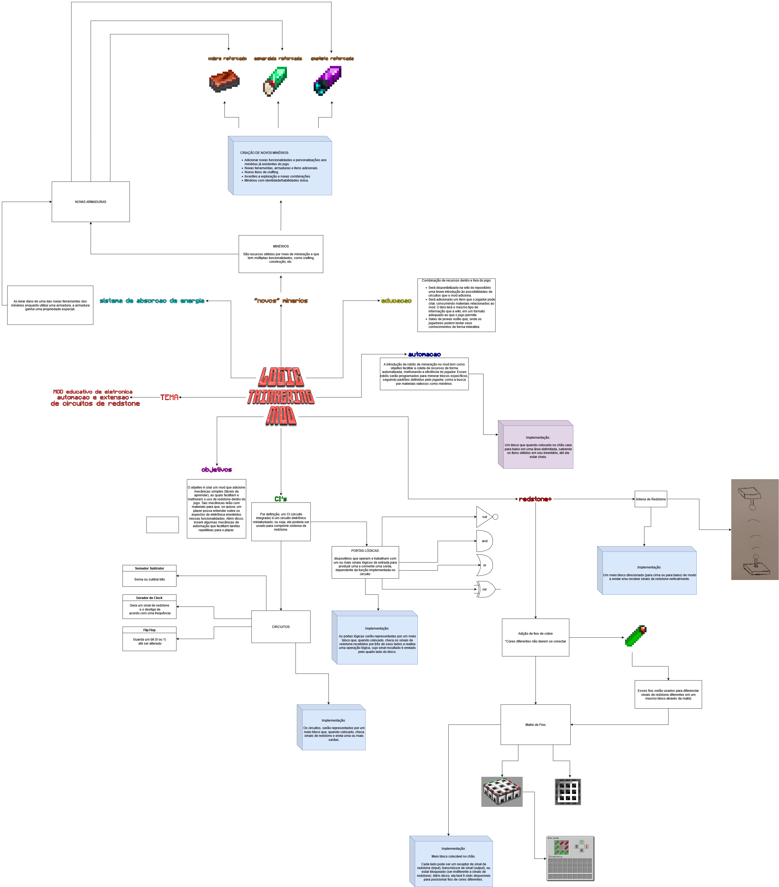

# Mapa Mental

## Introdução

&emsp;&emsp;
O Mapa Mental é um artefato amplamente utilizado na área de desenvolvimento de software para a organização de ideias, conceitos e processos de forma intuitiva e estruturada. Trata-se de uma ferramenta visual que auxilia na compreensão e no planejamento de projetos, proporcionando maior clareza sobre as interdependências e os fluxos de informações dos diversos componentes do sistema. No contexto da disciplina de Arquitetura e Desenho de Software, o Mapa Mental contribui para delinear as etapas de construção, as tecnologias e metodologias que serão utilizadas, além das especificações do tema a ser explorado no artefato, servindo como um guia para toda a equipe de desenvolvimento.

## Objetivo

&emsp;&emsp;
O objetivo da equipe com a realizacao do artefato foi de construir uma visão clara e abrangente do projeto ao destacar o propósito central do produto, as funcionalidades essenciais, as tecnologias previstas e os relacionamentos entre os componentes identificados previamente no Brainstorming. Ademais, a equipe buscou decorrer acerca dos tópicos discutidos, enriquecendo o projeto com detalhes que tornem sua implementação mais consistente e verossimilhante. Dessa forma, com a utilização deste artefato, pretende-se promover um entendimento coletivo entre os membros da equipe, além de simplificar a tomada de decisões e facilitar o planejamento e a comunicação das ideias e das etapas de desenvolvimento. 

## Metodologia

&emsp;&emsp;
Embora o material acadêmico sugerisse ferramentas específicas para a elaboração de mapas mentais, como MindMeister, iMindMap e XMind, optamos por utilizar o Draw.io para a criação da primeira versão do mapa mental devido à maior familiaridade da equipe com essa plataforma. Além disso, o Discord foi utilizado para facilitar a comunicação e garantir o alinhamento das ideias entre os membros da equipe.

&emsp;&emsp;
O time revisou os tópicos levantados no brainstorming e os desdobrou no mapa mental, adicionando novas ideias ao projeto conforme surgiam. Essa metodologia colaborativa garantiu que o mapa mental refletisse com precisão o entendimento coletivo e os objetivos do projeto, facilitando tanto a tomada de decisões quanto o planejamento em equipe.

## Resultado

## Bibliografia

> [1] **SERRANO, Milene**. Videoaula: 02e - VideoAula - DSW-Base - MapaMental. [Online]. Disponível em: https://unbbr-my.sharepoint.com/:v:/g/personal/mileneserrano_unb_br/ESf1VzOX5FpKshX0whG71jsBjO5-5HxjSUwnazFY1nJZtA?e=cGobi6. Acesso em: 02 nov. 2024.

## Participantes

| Matrícula | Aluno                             | Git                                                           |
|-----------|-----------------------------------|---------------------------------------------------------------|
| 221008024 | Eduardo Matheus dos Santos Sandes | [DiceRunner714](https://github.com/DiceRunner714)             |
| 170010872 | Gabriela de Oliveira Lemos        | [heylisten64](https://github.com/heylisten64)                 |
| 221008445 | Samara Letícia Alves dos Santos   | [samarawwleticia](https://github.com/samarawwleticia)         |
| 211062526 | Thomas Queiroz Souza Alves        | [thmasq](https://github.com/thmasq)                           |
| 202017263 | Vinicius de Oliveira Santos       | [ViniciussdeOliveira](https://github.com/ViniciussdeOliveira) |

---

## Histórico de Versão

| Versão | Data da alteração |      Alteração       |                         Responsável                          |                          Revisor                          | Data de revisão |
|:------:|:-----------------:|:--------------------:|:------------------------------------------------------------:|:---------------------------------------------------------:|:---------------:|
|  1.0   |       31/10       | Criação do documento | [Gabriela de Oliveira Lemos](https://github.com/heylisten64) | [João Antonio G. Carvalho](https://github.com/joaoseisei) |      02/11      |

## Controle de Revisão

|                        Revisor(es)                        |                                                           O que foi realizado                                                            |
|:---------------------------------------------------------:|:----------------------------------------------------------------------------------------------------------------------------------------:|
| [João Antonio G. Carvalho](https://github.com/joaoseisei) | Revisão do mapa mental para ficar de acordo com a videoaula da professora Milene, além de adicionar a referência bibliografica da mesma. |