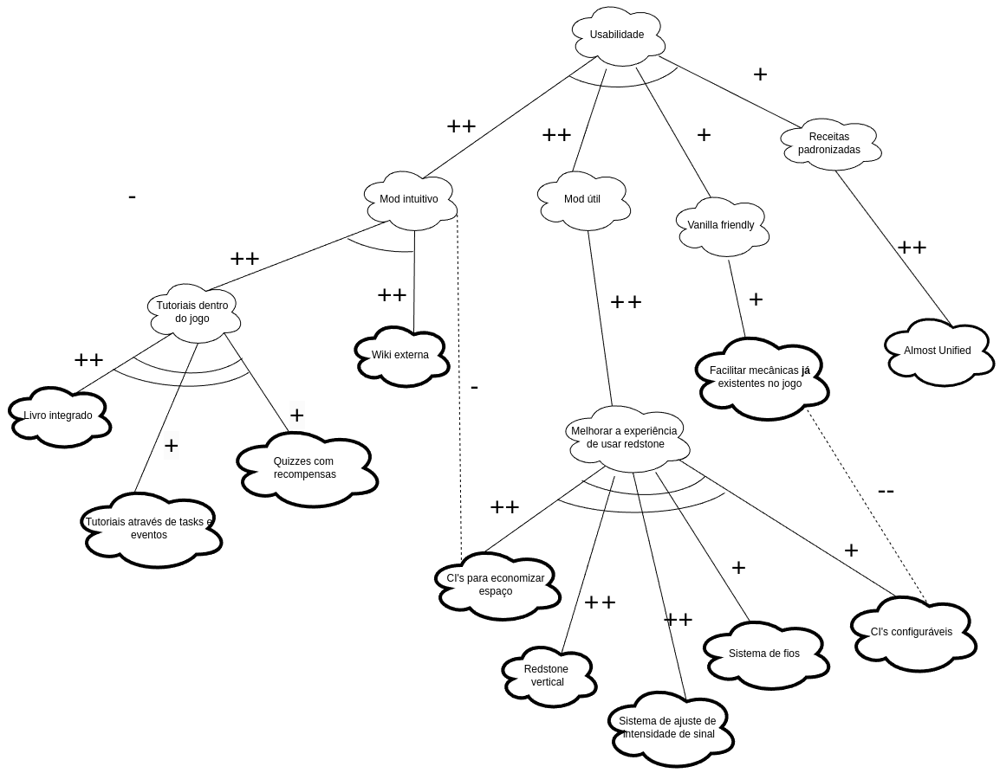
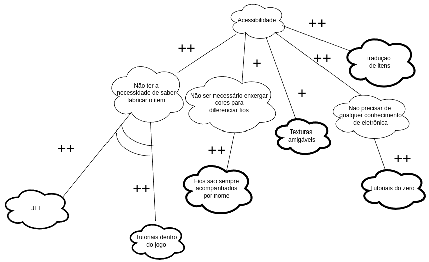
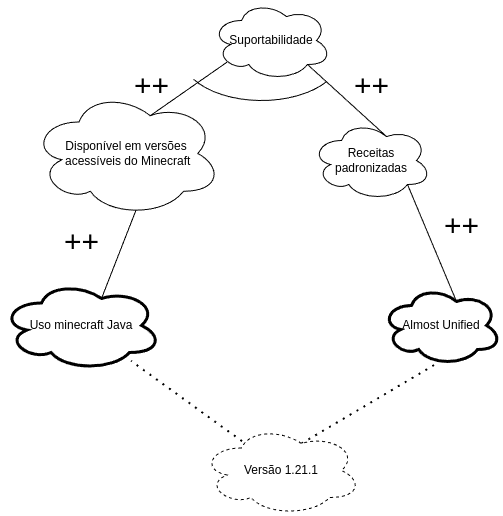
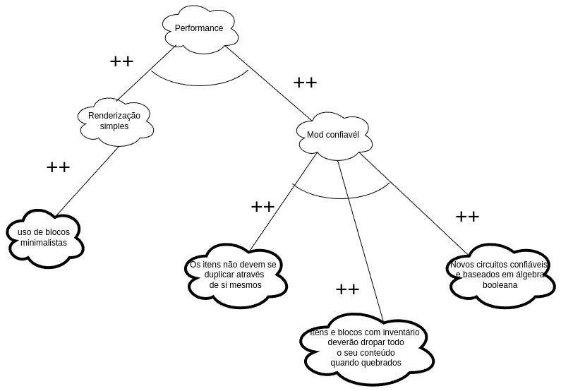
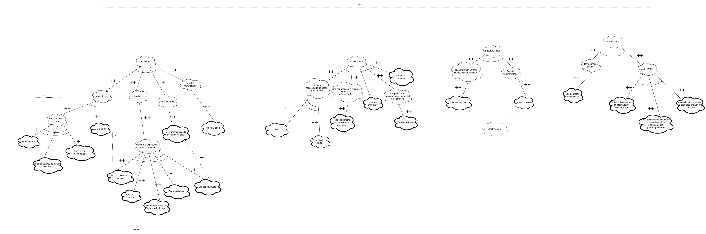

# NFR FRAMEWORK

## Introdução
O NFR Framework é uma abordagem que visa capturar, representar e analisar requisitos não funcionais em projetos de desenvolvimento de software. Diferente dos requisitos funcionais, que especificam o que o sistema deve fazer, os requisitos não funcionais descrevem as restrições e as qualidades que o sistema deve atender, como desempenho, segurança e usabilidade. Este framework ajuda a gerenciar a complexidade de incorporar esses aspectos qualitativos, proporcionando uma visão estruturada para garantir que os objetivos de qualidade sejam atendidos durante todo o ciclo de vida do projeto.

## Objetivo
O principal objetivo do NFR Framework é fornecer uma metodologia eficaz para modelar, avaliar e priorizar requisitos não funcionais, garantindo que eles sejam integrados desde o início do processo de desenvolvimento. A ferramenta auxilia a identificar possíveis conflitos entre diferentes requisitos de qualidade, encontrar compromissos e traçar estratégias para sua implementação (por meio da fragmentação de Goals em operacionabilidades). Ao fazer isso, busca-se garantir que as metas de qualidade sejam mensuráveis e estejam alinhadas com os objetivos do negócio e as expectativas dos usuários.

## Metodologia
A metodologia do *NFR Framework* envolve a decomposição dos requisitos não funcionais em metas de qualidade que podem ser analisadas e monitoradas. O processo inclui as seguintes etapas principais:

1. **Modelagem das Metas de Qualidade**: As metas de qualidade são representadas em diagramas, muitas vezes na forma de árvores de metas, onde requisitos abstratos são refinados em sub-metas mais concretas.
2. **Catalogação de Softgoals**: Os requisitos não funcionais são tratados como "softgoals" que, diferentemente de objetivos rígidos, têm graus de satisfação que podem variar.
3. **Análise de Contribuições**: Cada sub-meta é avaliada em termos de como contribui para a satisfação ou conflito com outras metas, permitindo a identificação de interdependências.
4. **Documentação de Racionalizações**: Justificativas são registradas para explicar as decisões tomadas e os compromissos aceitos ao longo do processo.
5. **Avaliação Contínua**: A metodologia enfatiza a necessidade de revisão periódica dos requisitos não funcionais para garantir que eles continuem relevantes e alinhados às mudanças no projeto e no mercado.

# Resultados

## NFR001 - Usabilidade

## NFR002 - Acessibilidade

## NFR003 - Suportabilidade

## NFR004 - Performance

## NFR GERAL - Com propagação de Impactos

---

## Participantes

| Matrícula | Aluno                             | Git                                               |
| --------- | --------------------------------- | ------------------------------------------------- |
| 221008445 | Samara Letícia Alves dos Santos | [samarawwleticia](https://github.com/samarawwleticia) |
| 221037993 | Patrícia Helena Macedo da Silva        | [patyhelenaa](https://github.com/patyhelenaa)     |
| 221008024 | Eduardo Matheus dos Santos Sandes | [DiceRunner714](https://github.com/DiceRunner714) |
| 170010872 | Gabriela de Oliveira Lemos        | [heylisten64](https://github.com/heylisten64)     |
| 221008150 | João Antonio Ginuino Carvalho     | [joaoseisei](https://github.com/joaoseisei)       |
| 211062526 | Thomas Queiroz Souza Alves            | [thmasq](https://github.com/thmasq) |

## Histórico de versão

| Versão | Data da alteração |      Alteração       |                    Responsável                     |                     Revisor                      | Data de revisão |
| :----: | :---------------: | :------------------: | :------------------------------------------------: | :----------------------------------------------: | :-------------: |
|  1.0   |       03/11       | Criação do documento | [Samara Letícia](https://github.com/samarawwleticia) |  |          |
|        |                   |                      |                                                    |                                                  |                 |

