# Questionário

## Introdução

Este documento apresenta os resultados de um formulário no [Google Forms](https://docs.google.com/forms/) aplicado junto a outros jogadores de Minecraft para coletar percepções e avaliar a importância das funcionalidades do Mod Logic Thinkering que estamos desenvolvendo, juntamente com seus respectivos [protótipos](Base/Design_Sprint/prototipo.md).

## Metodologia

O grupo elaborou um formulário no Google Forms, colaborando na criação de perguntas de forma objetiva e direta, com o intuito de manter a motivação dos participantes. Considerando que formulários longos podem resultar em menor taxa de resposta, optou-se por uma estrutura concisa, reduzindo o tempo necessário para preenchimento.

O formulário foi distribuído por meio de grupos no WhatsApp, o que permitiu alcançar um grande número de pessoas de forma rápida e eficiente.

Primeiramente, solicitamos aos participantes que indicassem seu nível de experiência em diferentes áreas do jogo relacionadas ao mod, permitindo uma análise cruzada entre o nível de conhecimento do usuário e suas respostas.

Em seguida, apresentamos uma lista das funcionalidades desejadas para o mod e pedimos aos participantes que avaliassem cada uma em uma escala de 1 a 5, em que 1 representava "pouco interessante" e 5 "muito desejável".

Por fim, colocamos um espaço para que os usuários pudessem retornar sugestões ou feedback.

## Resultados

Obtivemos 46 respostas até o momento. Dentre essas 46 respostas, 50% dos participantes afirmaram ser experientes no jogo. 15,2% Experientes com a mecânica de Redstone e 4,3% em eletrônica.

__Análise de conhecimento dos participantes:__

#### **Pergunta 1:**

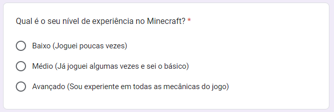

Figura 1: Qual é o seu nivel de experiência no Minecraft?

__Resposta:__

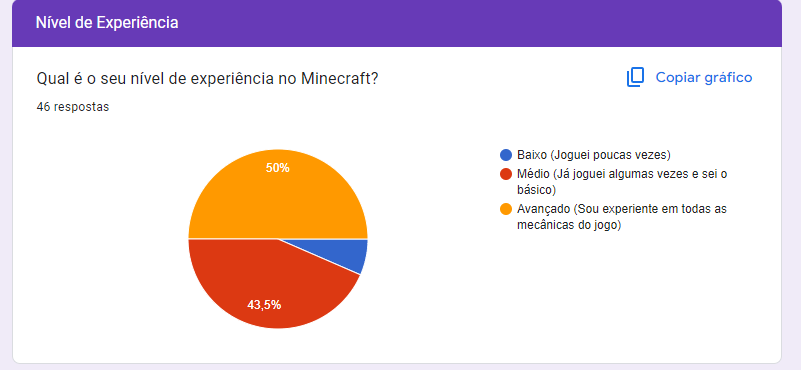

Figura 2: Resposta - Qual é o seu nivel de experiência no Minecraft?

#### **Pergunta 2:**

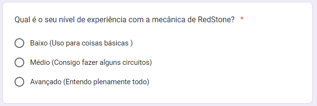

Figura 3: Qual é o seu nível de experiência com a mecânica de RedStone?  

__Resposta:__

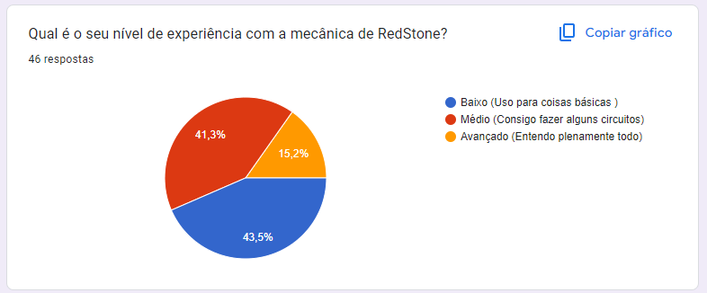

Figura 4: Resposta - Qual é o seu nível de experiência com a mecânica de RedStone?  

#### **Pergunta 3:**

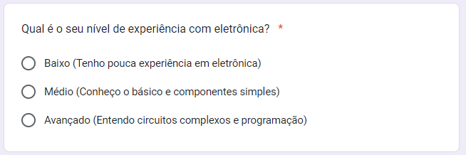

Figura 5: Qual é o seu nível de experiência com eletrônica?  

__Resposta:__

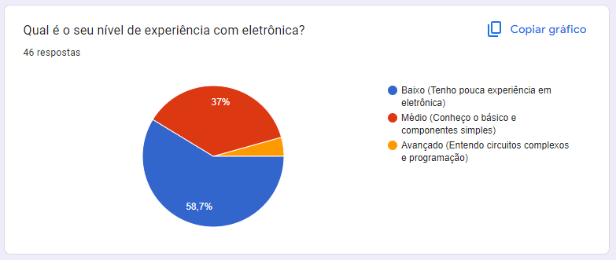

Figura 6: Resposta - Qual é o seu nível de experiência com eletrônica?  

__De 1 a 5 como você classificaria as seguintes funcionalidades?__

#### **Minérios reforçados** (ametista, cobre e esmeralda) para a criação de ferramentas e armaduras que ainda não estão disponíveis no jogo:

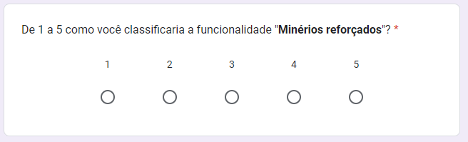

Figura 7: De 1 a 5 como você classificaria a funcionalidade **"Minérios reforçados"**?

__Resposta:__

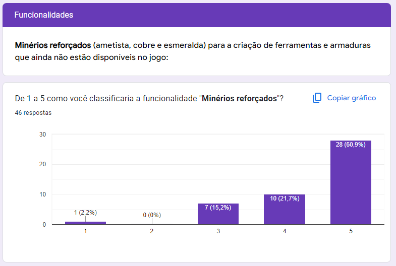

Figura 8: Resposta - De 1 a 5 como você classificaria a funcionalidade "Minérios reforçados"? 

#### **Fios de Cobre Coloridos** para que mais de uma carga de redstone não interfira em outra no mesmo bloco:

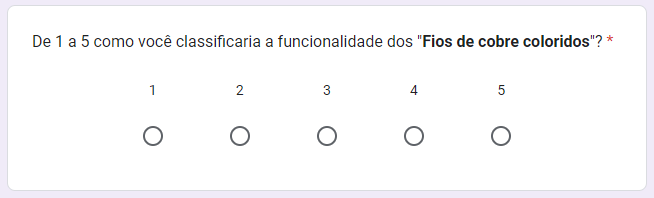

Figura 9: De 1 a 5 como você classificaria a funcionalidade dos "Fios de cobre coloridos"? 

__Resposta:__

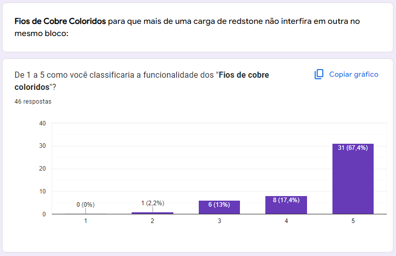

Figura 10: Resposta - De 1 a 5 como você classificaria a funcionalidade dos "Fios de cobre coloridos"? 

#### **Absorção de energia**: quando o jogador recebe dano enquanto está equipado com uma armadura de minério reforçado e segurando uma ferramenta do mesmo minério, a eficiência da ferramenta aumentará temporariamente ou sua durabilidade será restaurada.

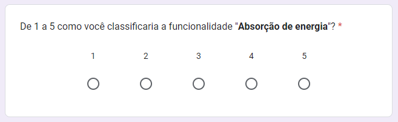

Figura 11: De 1 a 5 como você classificaria a funcionalidade "Absorção de energia"?  

__Resposta:__

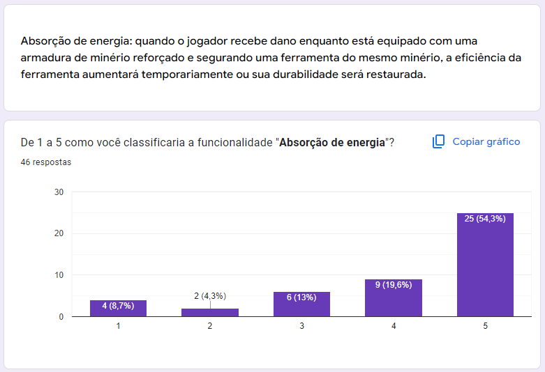

Figura 12: Resposta - De 1 a 5 como você classificaria a funcionalidade "Absorção de energia"? 

#### **Circuitos comprimidos** introduz blocos que realizam operações lógicas já presentes no sistema de redstone convencional, porém ocupando menos espaço e sendo mais simples do que no jogo convencional:

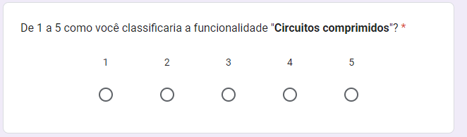

Figura 13: De 1 a 5 como você classificaria a funcionalidade "Circuitos comprimidos"?

__Resposta:__

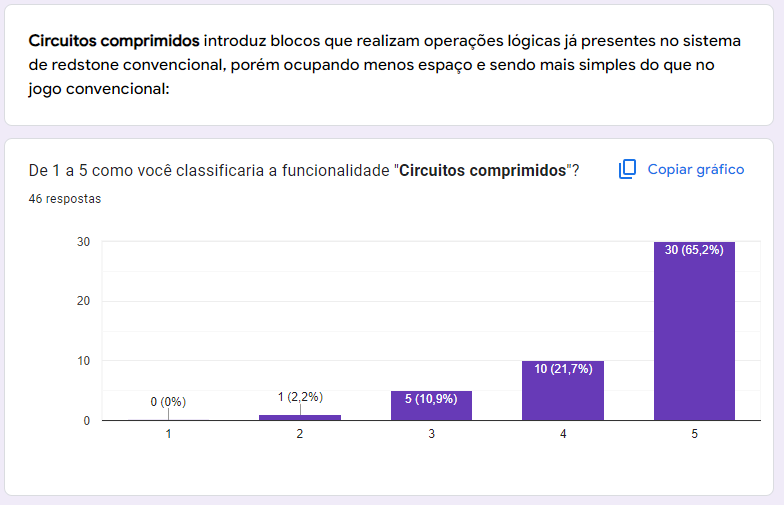

Figura 14: Resposta - De 1 a 5 como você classificaria a funcionalidade "Circuitos comprimidos"? 

#### **Robo minerador** introduz um bloco que escava uma área predeterminada, salvando os itens coletados em seu inventário:

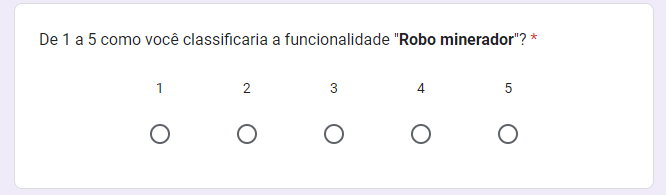

Figura 15: De 1 a 5 como você classificaria a funcionalidade "Robo minerador"?

__Resposta:__

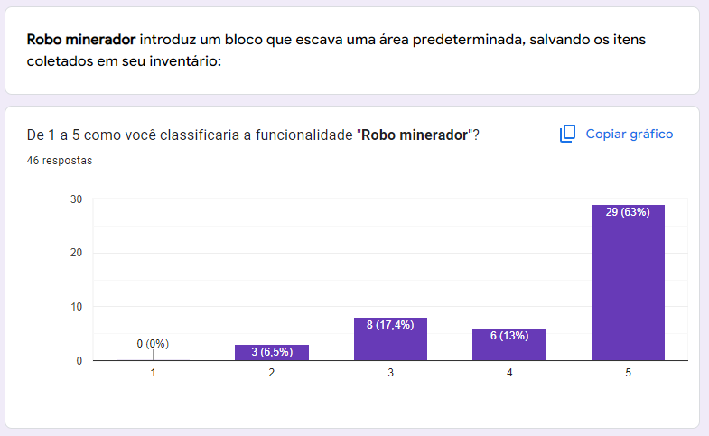

Figura 16: Resposta - De 1 a 5 como você classificaria a funcionalidade "Robo minerador"?

#### **Se você tiver sugestões ou qualquer feedback sobre o que podemos melhorar, por favor, compartilhe abaixo.:**

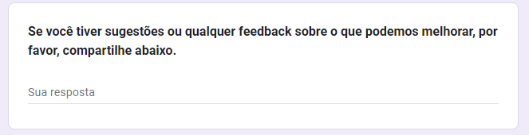

Figura 17: Se você tiver sugestões ou qualquer feedback sobre o que podemos melhorar, por favor, compartilhe abaixo.

__Resposta:__

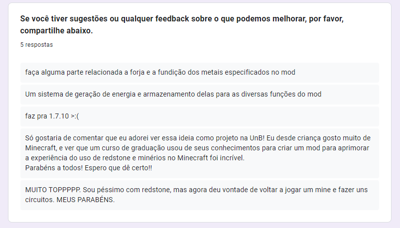

Figura 18: Resposta - Se você tiver sugestões ou qualquer feedback sobre o que podemos melhorar, por favor, compartilhe abaixo.

## Participantes

| Matrícula | Aluno                             | Git                                               |
| --------- | --------------------------------- | ------------------------------------------------- |
| 221008445 | Samara Letícia Alves dos Santos | [samarawwleticia](https://github.com/samarawwleticia) |
| 221037993 | Patrícia Helena Macedo da Silva        | [patyhelenaa](https://github.com/patyhelenaa)     |
| 221008024 | Eduardo Matheus dos Santos Sandes | [DiceRunner714](https://github.com/DiceRunner714) |
| 221031265 | Carlos Eduardo Rodrigues        | [carlos-kadu](https://github.com/carlos-kadu)         |
| 211062526 | Thomas Queiroz Souza Alves        | [thmasq](https://github.com/thmasq)  |
| 221021886 | Cássio Sousa dos Reis             | [csreis72](https://github.com/csreis72) |
| 221007869 | Artur Henrique Holz Bartz         | [H0lzz](https://github.com/H0lzz)  |

## Histórico de Versão

| Versão | Data da alteração |                       Alteração                       |                          Responsável                           |                                                                                             Revisor                                                                                              | Data de revisão |
| :----: | :---------------: | :---------------------------------------------------: | :------------------------------------------------------------: | :----------------------------------------------------------------------------------------------------------------------------------------------------------------------------------------------: | :-------------: |
|  1.0   |       03/11       |                 Criação do documento                  |             [Samara Letícia](https://github.com/samarawwleticia)              |     |          |
                                                                    

## Controle de Revisão

|                Revisor(es)                 |                      O que foi realizado                      |
| :----------------------------------------: | :-----------------------------------------------------------: |
| [Danilo Melo](https://github.com/daniloctm) | Adiciona hyperlink para o prototipo, adição de informações sobre a distribuição do questionário |

